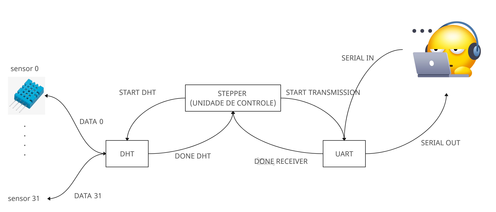
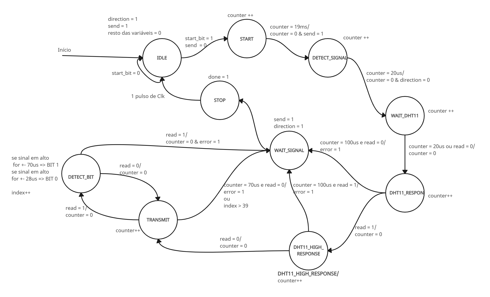

# DigitalSensorQuery
## Introdução - Guilherme

## Metodologia

Para desenvolvimento do sistema proposto, foram estipuladas quais seriam as ferramentas utilizadas e quais as etapas a serem seguidas. 
A nível de organização, o projeto foi dividido em partes (módulos), a fim de facilitar a manutenção, escalabilidade, testabilidade, entendimento e documentação.

As ferramentas utilizadas no desenvolvimento do projeto foram:
   - FPGA CYCLONE IV
   - Sensor(es) DHT11
   - Software Quartus
   - Editor de Texto para escrita do código em C e Terminal Linux para compilar e executar o código
   - Software Creately para modelagem do sistema e máquinas de estados

As etapas que foram seguidas em ordem cronológica, foram:
   1. Protocolo UART
      1. Estudo do funcionamento do protocolo de comunicação
      2. Desenvolvimento do Código em C responsável pela transmissão e recebimento dos dados pelo usuário
      3. Desenvolvimento do Código em Verilog da máquina de estados responsável pela UART na FPGA
      4. Desenvolvimento do gerador de Baud Rate para a comunicação serial
   2. Sensor DHT11
      1. Estudo do funcionamento do DHT11 por meio da leitura do seu datasheet
      2. Desenvolvimento da máquina de estados em Verilog capaz de acionar o sensor e coletar a temperatura e a umidade
      3. Para funcionamento desta máquina, foram desenvolvidos:
         1. Um módulo Tri State para controle do fluxo de dados entre a FPGA e o sensor (Ora a FPGA manda sinal, ora o sensor manda sinal)
         2. Um módulo de geração de Clock com periódo de 1 microssegundo, já que o tempo das respostas do sensor é baseado em microssegundos
   3. Unidade de Controle - Stepper
      1. Modelagem do módulo
      2. Desenvolvimento da máquina de estados em Verilog
   4. Ajuste de erros e testagem
      
## Descrição do Projeto:

   ### Diagrama em alto nível
   Por meio de uma interface com o computador, o sistema propõe que o usuário consiga solicitar a temperatura e umidade atual de até 32 sensores DHT11. Além de informar a temperatura/umidade em um determinado instante, o sistema é capaz de informar a temperatura/umidade de maneira continua a cada 2 segundos aproximadamente, caso o usuário queira. O diagrama em alto nível deste projeto pode ser visto logo abaixo.

   

   As requisições do usuário são enviadas serialmente para um módulo UART da placa FPGA Cyclone IV. Quando terminado o envio de todos os bits de transmissão do PC para a placa, o módulo UART envia um bit de sinal "DONE RECEIVER" para a unidade de controle da placa, chamada de Stepper, além dos bits que correspondem ao comando requistado e o endereço do sensor requisitado.  

   Após isto, a unidade de controle envia um sinal de start para o módulo DHT que, por sua vez, inicia sua comunicação com o sensor requisitado. Este módulo consegue coletar tanto a temperatura, quanto a umidade apontadas pelo sensor, e ao terminar esta coleta, envia um sinal de retorno para o Stepper, indicando o término da comunicação com o DHT11, juntamente com a temperatura e a umidade.  

   O Stepper com posse da temperatura e umidade coletada, consegue então enviar as informações requisitadas pelo o usuário. Para transmitir os dados, há a necessidade da unidade de controle enviar um sinal de início de transmissão para a UART, já que é ela a responsável pela comunicação com o computador.  

   Por fim, a UART transmite serialmente para o computador os bits contendo o valor obitido da temperatura/umidade, juntamente com o endereço do sensor requisitado e o comando de resposta.  

   ### C - Mendes

   ### UART

   A UART, ou Universal Asynchronous Receiver/Transmitter, é um componente vital na comunicação entre dispositivos microcontroladores. Ela permite a transmissão e recepção de dados de forma assíncrona, sem a necessidade de um sinal de clock compartilhado entre os dispositivos.

   O transmissor UART é responsável por enviar os dados do dispositivo de origem para o destino. Funciona enviando os dados em pacotes, iniciando com um bit de início (start bit) para sincronização. Os bits de dados são transmitidos, geralmente, com o menos significativo primeiro. Opcionalmente, um bit de paridade pode ser incluído para detecção de erros. Por fim, um ou mais bits de parada são anexados para indicar o fim da transmissão.

   O receptor UART no dispositivo de destino decodifica os dados recebidos. Ele aguarda o início de um pacote detectando o bit de início, e lê os bits de dados conforme são recebidos. Se a paridade for utilizada, o receptor verifica se o número de bits de dados recebidos está correto. Ao identificar os bits de parada, determina o fim da transmissão e decodifica os bits de volta aos dados originais.

   Para o projeto, foi desenvolvido um módulo em Verilog capaz de se comunicar com o PC, recebendo comandos de requisições e enviando comandos de respostas, seguindo o protocolo UART. O módulo é dividido em duas partes: a UART Rx (Receptor UART) e  UART Tx (Transmissor UART). O receptor UART é résponsável por receber 2 bytes, um do endereço do sensor requisitdo e um do comando escolhido pelo usuário. Já o transmissor UART é responsável por enviar 3 bytes para o computador, um byte para o endereço do sensor que foi monitorado, um byte para comando de resposta e um byte para o valor obtido da temperatura ou umidade.

   ### DHT11
   Para desenvolvimento da máquina responsável pela comunicação com os sensosres DHT11, foi feita a leitura do datasheet que pode ser acessado nesse link: [Datasheet DHT11](public/DHT11-Technical-Data-Sheet.pdf). A comunicação entre o sensor e a FPGA é feita pelo pino chamado DATA, que é um barramento único de entrada e saída de dados - por um momento o sensor que recebe sinais da FPGA e depois de um tempo, o sensor que envia sinais para a FPGA. Devido a esta alternância do fluxo de dados, foi desenvolvido um módulo em Verilog chamado de TriState. Nele há uma variável binária "direction" que quando é 0, o sentido da transmissão de dados é do DHT11 para a FPGA, e quando é 1, o sentindo alterna.

  O processo de comunicação entre a placa e o sensor é feito por sinais digitais, ora o sinal está em alta (1), ora está em baixa (0), e o tempo de duração do sinal em um determinado nível dura em geral microssegundos. Por este motivo, foi desenvolvido um módulo gerador de microssegundo, que pega o clock da FPGA (50 MHz) e gera um clock de 1 MHz (1 microssegundo).

  O diagrama da máquina de estados desenvolvida em Verilog para a comunicação com o sensor pode ser vista logo abaixo. Inicialmente a máquina começa no estado de espera (IDLE), isto é, esperando que a unidade de controle avise que a comunicação com aquele sensor possa começar. Direction = 1 indica que é a FPGA que envia sinal para o sensor, e send = 1 indica que o sinal que está sendo enviado para o sensor é 1. Quando a unidade de controle avisa que a transmissão começou (start_bit = 1), a máquina passa para o próximo estado, Start, enviando 0 para o sensor por 19 ms. Passado este tempo, a máquina vai para o próximo estado, Detect_signal, onde a FPGA envia 1 para o sensor por 20 microssegundos. A partir dai, o fluxo da transmissão dos dados é alternado (sensor --> FPGA) e é esperada a resposta do sensor. Quando o sensor responde, a máquina alterna para o estado DHT11_RESPONSE. É esperado que o sensor fique nesse estado enquanto estiver enviando 0 para a FPGA por até 100 microssegundos. Se passar deste tempo e não houve mudnça de nível lógico para 1, ocorreu um erro na comunicação e a máquina vai para WAIT_SIGNAL. Senão, a máquina pode prosseguir. O próximo estado realiza a mesma coisa do anterior, só que agora o sensor está enviando 1 para FPGA. 
  
  Se até ai, tudo acontecer como o esperado, a máquina inicia o processo de transmissão e identificação dos 40 bits que correspodem a umidade e temperatura. O DHT11 envia um sinal em nível baixo por aproximadamente 50 microssegundos e depois sobe o sinal para 1. A extensão do sinal em nível alto determina qual o bit que está sendo enviado, se for por aproximadamente 30 microssegundos é o bit 0, se for por aproximadamente 70 microssegundos é o bit 1. Esse processo de identificar o bit é feito para cada um dos 40 bits. Após a conclusão da comunicação, a máquina vai para o WAIT_SIGNAL, onde o direction e send retornam para seu valor inicial (1) e onde visto se houve erro no processo de comunicação com o sensor ou não. Realizada tal etapa, a máquina vai para o estado de STOP, sendo enviado para a unidade de controle um sinal de conclusão da comunicação.

   ### STEPPER - Mendes

## Descrição e análise dos testes

Durante o processo de teste, o projeto enfrentou diversos desafios, os quais foram essenciais para aprimorá-lo. Esses testes incluíram simulações no próprio Quartus, abrangendo aspectos dos módulos como o DHT e a UART. No entanto, para além das simulções no software, algumas outras simulações foram realizadas com auxílio de oscilosópio e das interfaces da própria placa FPGA.

Estes últimos foram conduzidos com o objetivo de avaliar praticamente cada módulo de forma independente. Por exemplo, o sensor DHT11 foi integrado a um único botão com pulso para minimizar ruídos. O botão foi utilizado para dar início a comunicação com o sensor - quando pressionado, o senso era ativado. Em seguida, utilizando um osciloscópio, foi verificado se o sensor realmente respondeu corretamente, observando as ondas geradas. Por sua vez, o código C foi criado e testado em conjunto com o módulo UART, como forma de observar se os dados mandados pela FPGA, assim como os recebidos, estavam de acordo com os valores passados manualmente.

Ao final, foi realizado um teste completo do projeto em conjunto para validar se as respostas estavam de acordo com as expectativas iniciais. Essa validação foi feita através do código C, que foi elaborado especificamente para receber e enviar dados pela UART via porta serial. 

## Conclusão - Guilherme

## Autores

- José Gabriel de Almeida Pontes
- Luis Guilherme Nunes Lima
- Pedro Mendes
- Thiago Pinto Pereira Sena
